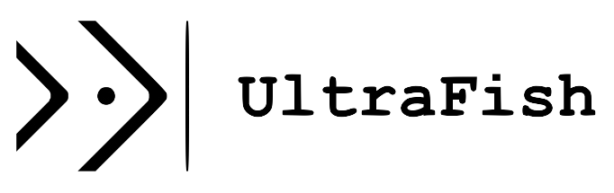

* [**All Topics**](/ "All - Topics - UltraFish")
* Programming
  * [**Java**](java.md "Java - Topics - UltraFish")
  * [**R**](index.md "R - Topics - UltraFish")
  * [**Markdown**](index.md "Markdown - Topics - UltraFish")
  * [**C++**](index.md "C++ - Topics - UltraFish")
  * [**Python**](index.md "Python - Topics - UltraFish")
  * [**SQL**](sql.md "SQL - Topics - UltraFish")
* Data Structures and Algorithms
  * [**Data Structures**](data-structures.md "Data Structures - Topics - UltraFish")
  * [**Algorithms**](algorithms.md "Algorithms - Topics - UltraFish")
* Others
  * [**Life**](life.md "Life - Topics - UltraFish")
* 